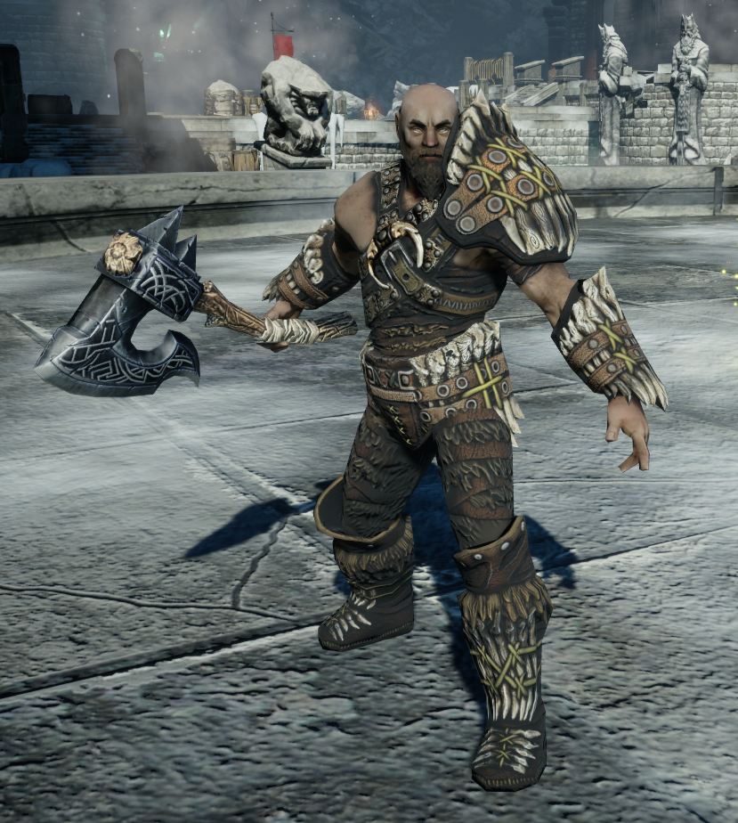
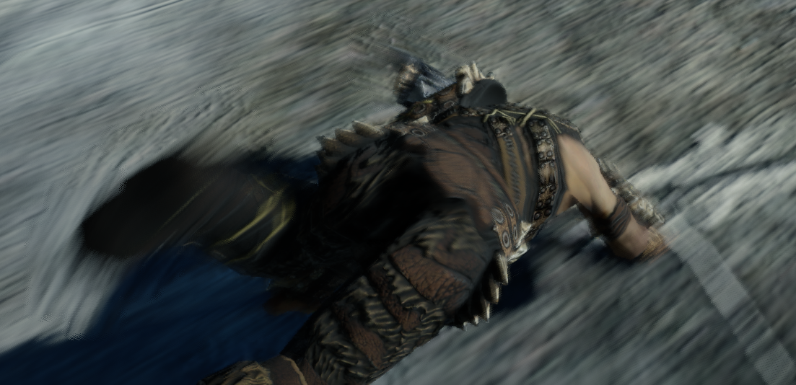
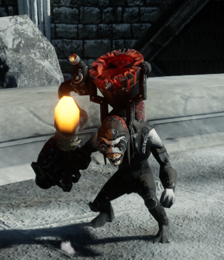
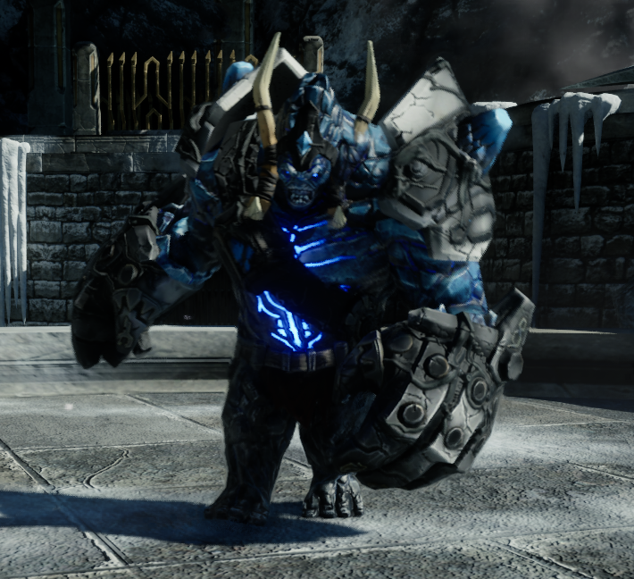

# 【Blur ARPG Warrior】
---

### ***阅读中文文档 >[中文](README_cn.md)***
### ***日本語のドキュメントを読む >[日本語](README_ja.md)***
### ***Read this document in >[English](README_en.md)***

プロジェクトのコメントの翻訳が進行中です。
Translation of project comments is in progress.
---

# 【项目简介】
使用`Unreal Engine 5.4.4`开发的`ARPG`游戏。基于`Gameplay`框架进行开发，使用`GAS`插件实现了技能功能。\
核心功能部分使用C++，上层功能使用蓝图的标准商业化开发模式。\
生存游戏模式下，玩家可以操控Hero角色在竞技场内和各种怪物战斗。

## 【今后的研究方向】
功能代码和上层业务代码的隔离，封装ARPGGameFramework插件作为底层功能插件，提高复用性。\
开发项目链接：https://github.com/BlurFeng/Blur_ARPG_Samurai

高级角色状态机的运用，提高游戏表现。\
开发项目链接：https://github.com/BlurFeng/BlurAdvancedCharacterLocomotion

# 【开发内容】
使用C++和蓝图，完整开发了整个游戏底层框架到上层功能。且功能数据可配置化。\
主要流程UI和UI材质的开发和修改，部分Image资源的制作。

## 【项目框架】
基于 Unreal Engine 的 Gameplay 框架开发的整体项目流程，包括 Character、Player Controller、Camera。以及各种功能 Component。\
基于 Data Assets 和 Curve Table 开发的项目配置流程。\
基于 Gameplay Tag 的全局状态管理。\
基于 USaveGame 类的简单存档系统。\
基于 UMG 的UI通用模板类制作和游戏UI制作。

## 【角色动画状态机】
基于动画蓝图、Animation Layer 和 BlendSpace 开发的角色动画状态机。\
八方行走的Locomotion动画状态，允许在 Arm 和 Unarm 状态之间切换。\
基于 Montage 的事件动画（Attack）融合。使用 Notify 与功能逻辑进行沟通。\
MotionWarping用于技能中的位移变化。\
动画音效及特效的配置。

## 【技能系统】
基于`GAS`和`GameplayTag`的技能系统和游戏状态管理。\
用于玩家控制角色的攻击、防御、翻滚等各种功能的开发。以及敌人的技能开发。\
用于道具的功能开发。比如恢复生命值、体力值、增加怒气值等。\
通过 `GameplayCue` 实现技能的声音和特效的播放。

## 【游戏模式】
Survival生存游戏模式。以及四个可选的游戏难度。\
各种游戏模式状态之间的切换，以及可配置的等待时间，波次限制时间。\
可配置的敌人生成器，允许配置敌人种类、随机数量、本波次最大数量和生成间隔时间等。

## 【UI界面】
基于`UMG`开发了整个UI。以及各种按钮、进度条、图标等模板UI组件的开发，提升UI界面的开发效率。UI动画的开发提升了整体画面效果。\
英雄状态界面，包括生命值、体力值、怒气值和当前武器装备及武器技能。锁定模式的跟踪UI。\
敌人状态界面，包括小兵状态栏和首领状态栏。

\
首领状态栏。

主要流程界面，包括主界面、设置界面、暂停界面、胜利界面和失败界面。\
生存模式流程UI界面，包括模式和流程提示、倒计时。

## 【英雄】

### 输入系统
基于`EnhancedInput`的操作系统。可以在持有武器时进行输入操作的覆盖，在相同输入的情况下获得不同的角色反应。\
支持键盘和鼠标，以及手柄操作。
### 生命值
生命值，承受攻击时减少。允许通过道具回复生命值。
### 体力值
进行轻攻击、重攻击、翻滚和防御等行为将会消耗一定的体力值。体力值不足时无法进行这些行为。\
停止行为一段时间后，体力值会自动恢复。也可以使用道具来快速回复体力。
### 怒气值和愤怒状态
在成功击中目标并造成伤害，或者承受伤害等情况下，可以获得一定的怒气值。或者也可以通过道具来获得怒气值。

\
当怒气值满后，可以开启愤怒状态，愤怒状态下，攻击将具有额外的效果。比如创造冲击波来攻击敌人。

\
在愤怒状态下，愤怒值会不断下降，直到愤怒值为空，或者在愤怒值较低时允许主动停止愤怒状态。

### 翻滚
翻滚技能。允许进行大幅度的位移来躲避敌人的攻击。\
允许连续进行翻滚，或在翻滚之后进行攻击。

### 装备功能
武器的配备和卸下。不同武器可以赋予角色不同的技能。比如轻攻击和重攻击、特殊技能、防御等。

### 目标锁定
在角色装备武器时，允许锁定敌人，且可以在不同敌人间切换。

### 攻击连击
轻攻击和重攻击的连击Combo技能。一个Combo技能之间阶段的连接以及不同Combo技能之间的跳转。\
允许详细的配置Combo每一次攻击的事件。“开始接收下一次输入”，“允许进行下一次攻击”，“重置”。这样，根据玩家输入节奏的快慢，Combo的整体速度也会有所变化。\
允许配置JumpToAbilityInfos，可以在任一阶段通过其他输入来切换到其他技能Combo。来组合出复杂的Combo转换。

\
轻攻击1>轻攻击2>轻攻击3>重攻击终结。

### 武器特殊技能
武器特殊技能，允许玩家使用具有CD的强力技能来攻击敌人。

### 防御
防御功能，普通防御、完美防御和防御反击。

## 【敌人】

\
Guardian近战小兵。

\
Glacer远程小兵。

\
FrostGiant的首领敌人。

### AI
\
基于 `Behavior Tree` 行为树的敌人AI功能。允许敌人自动地对玩家进行攻击、躲避或召唤小兵等行为。\
基于 `Detour Crowd Avoidance` 的人群绕行避让功能。让敌人数量较多时，移动行为更加自然。\
基于`EQS`环境查询系统，可以获得各种敌人需要的目标，比如攻击目标、移动目标点等。\
基于`NavMesh`导航网格实现敌人的生成点查询和移动路径查询。

### 攻击技能
小兵和首领的多种近战技能和远程技能。以及通过GC实现技能的声音和特效。\
一些不可阻挡的技能在攻击时会有特效提示。

\
近战攻击。

\
远程攻击。

\
首领攻击。

### 召唤技能

\
首领在低血量时会召唤小兵进行支援。

### 危险提示
\
当攻击不可阻挡时，用特效进行提示。

## 【道具】
### 能量石头
生命石、体力石、愤怒石。在玩家拾取使用后可以恢复一定量的生命、体力或怒气。
石头在敌人死亡时掉落。根据配置的随机权重、敌人可以按要求随机生成不同的石头。

## 【逻辑功能】
用于支持游戏开发的各种功能性方法。

### 【Debug Helper】
C++中使用的Debug工具类，可以快捷的进行Debug。

### 【倒计时】
CountDown方法。基于`Latent Action`实现的倒计时蓝图节点。\
允许在蓝图创建一个倒计时节点。可以 Start 和 Cancel，并且在 Update、Completed、Cancelled 时执行需要的逻辑。 \
可以用于处理一些异步的逻辑。比如倒计时或冷却的UI显示。\
常用的蓝图节点 Delay 就是一个典型的`Latent Action`。

### 【GAS】
#### 技能任务
##### Tick更新
UAbilityTask_ExecuteTaskOnTick 类用于在 Gameplay Ability 内部实现Tick功能。\
可以满足在GA内部Tick进行逻辑的需求，比如在 Target Lock 目标锁定技能激活时，在Tick中更新角色自动面向目标和玩家切换目标的判断等。
##### 等待Event并生成Actors
UAbilityTask_WaitSpawnActors 类用于等待一个GameplayTag事件，并在之后执行Actor的生成。\
可以用于在GA中构建召唤敌人的逻辑。
#### GE计算类
UGEExecCalc_DamageTaken 类。通过可配置参数的公式，计算最终伤害。
UGEExecCalc_GainRageByDaTa 通过可配置参数的公式，计算被伤害时获得怒气值。 

### 【权重随机】
Random Index By Weights 系列方法。允许玩家传入权重数组，方法根据权重随机后返回一个随机到的Index。\
可用于敌人死亡时根据配置权重随机掉落道具等需求。

### 【插值并限制最小变化值】
Lerp Limit Change Min 方法允许在两个数之间插值，并限制返回插值的最小值，防止在最后的插值阶段两个数过于接近导致的极小变化。\
可用于血条增加或减少时的UI动画的自然变化。

## 【材质和特效】
材质的制作和扩展。包括敌人受击效果、死亡消融效果等实现。\

Niagara特效的使用。\
可用于敌人受击、进场和死亡退场的表现效果。

# 【Debug指引】
`'`按键（Enter左方）打开综合控制台。小键盘数字键开关显示内容。\
游玩隐藏鼠标时 Shift + F1 显示鼠标。

## 自动避障
`·`按键（Esc下方）打开控制台，输入 `ai.crowd.DebugSelectActor 1` 后选中敌人Actor查看自动避障相关信息的Debug绘制。

## GAS
`·`按键（Esc下方）打开控制台，输入 `showdebug abilitysystem` 后，来打开Debug界面查看角色GAS相关状态。\
使用 PageUp 和 PageDown 按钮来切换目标角色。\

需要在DefaultGame.ini中添加配置。\
[/Script/GameplayAbilities.AbilitySystemGlobals]\
bUseDebugTargetFromHud = true

## NavMesh
选中场景后，按`P`开关显示NavMesh生成范围。\
BT行为树的MoveTo功能需要NavMesh的支持。

## EQS
在场景中放置 EQSTestingPawn 并配置使用的EQ。可以在场景中可视化EQS相关信息数据。

# 【资源】
角色动作和模型，使用UE官方项目 Action RPG。\
 https://www.fab.com/zh-cn/listings/ef04a196-03c1-4204-998a-c7d5264fade7

场景模型使用免费资源 InfinityBladeIceLands。

UINavigation 插件，用于实现多硬件输入操控UI。