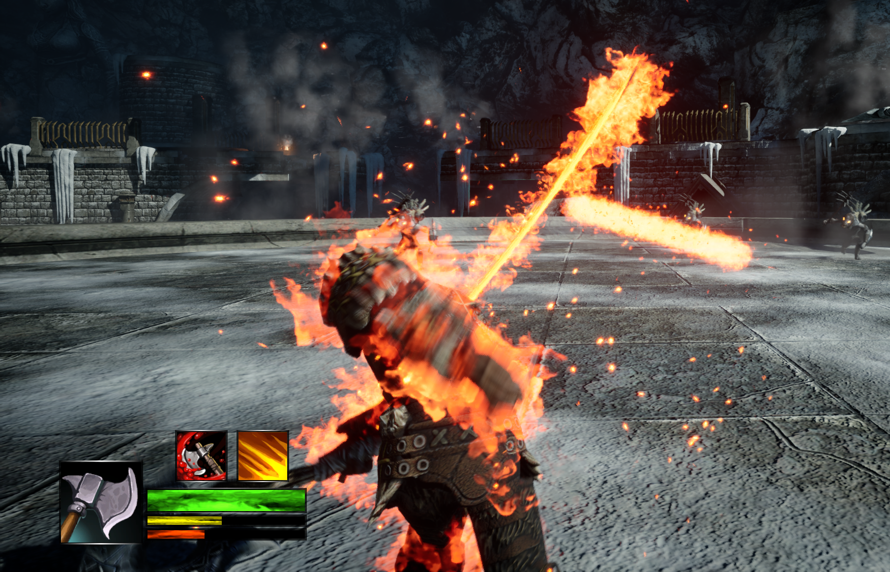
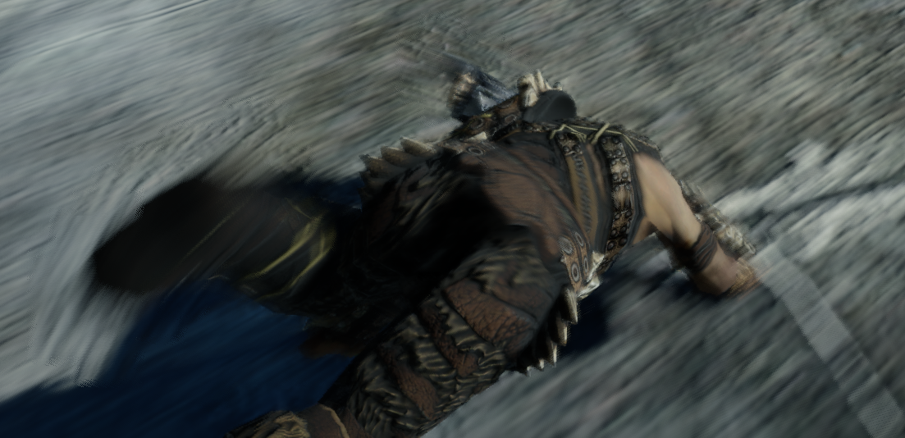
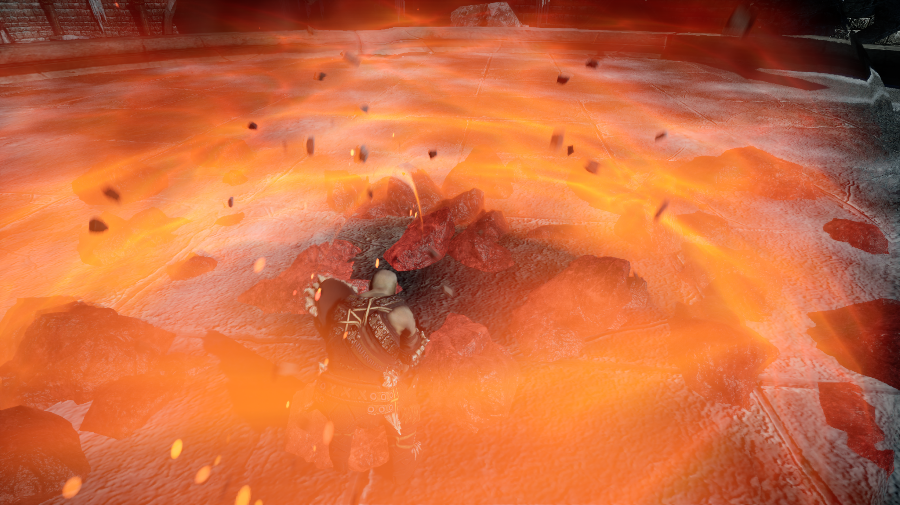
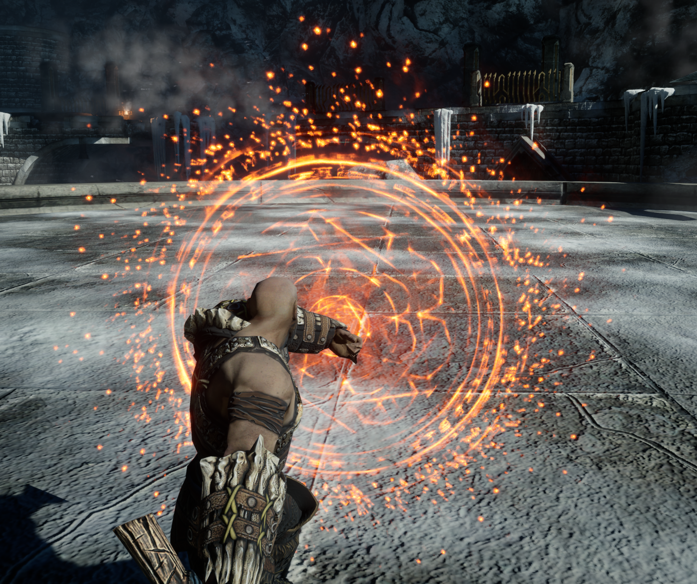
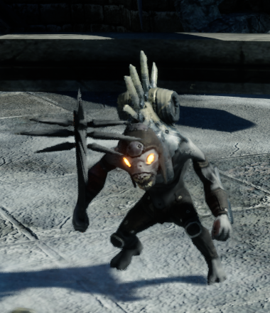
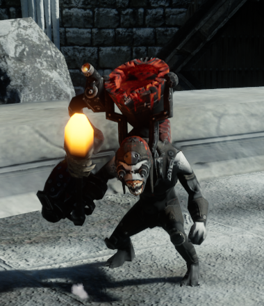
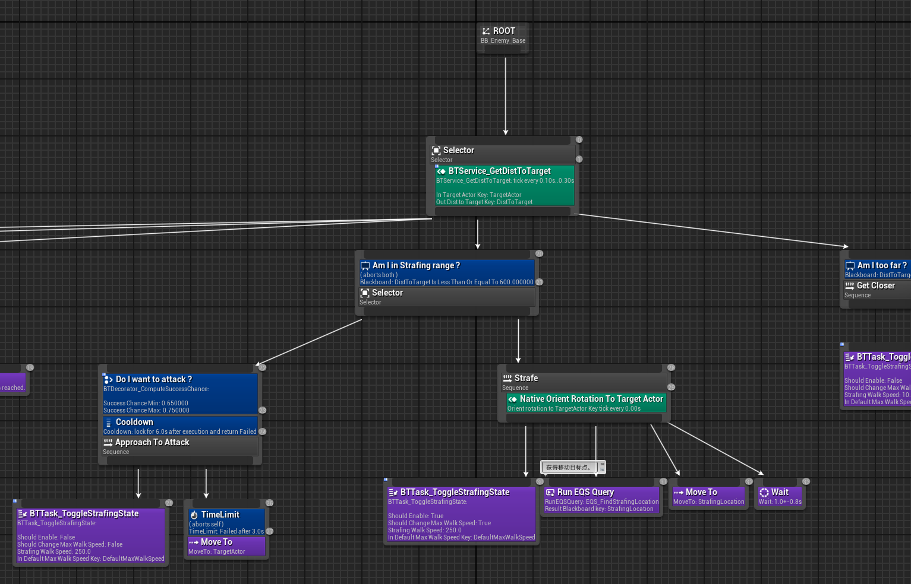
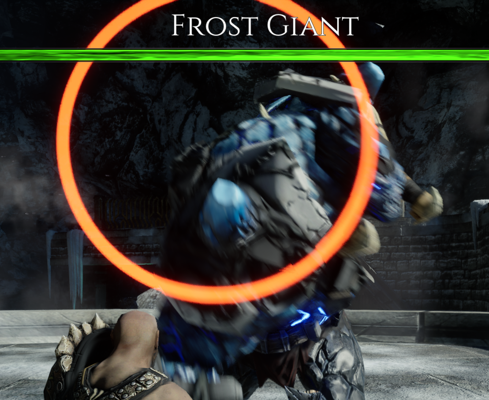
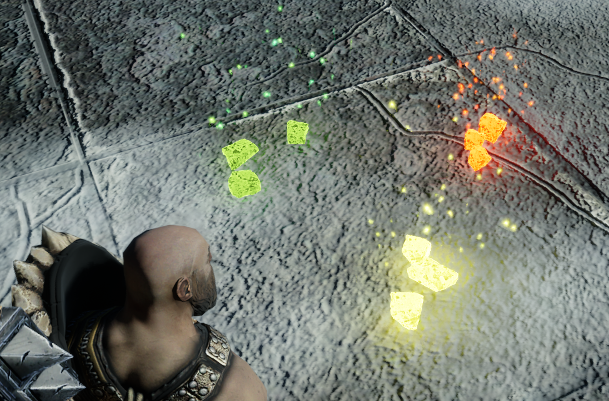
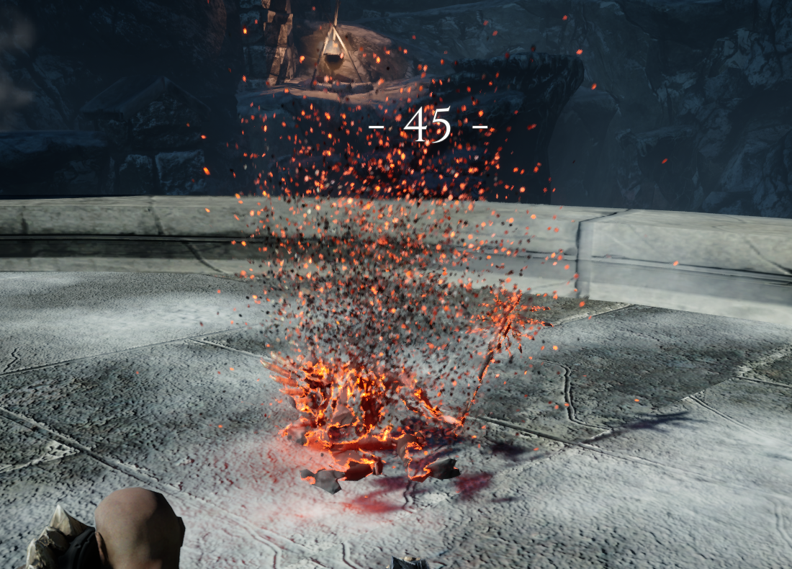

# 【Blur ARPG Warrior】
---

### ***阅读中文文档 >[中文](README_cn.md)***
### ***日本語のドキュメントを読む >[日本語](README_ja.md)***
### ***Read this document in >[English](README_en.md)***

プロジェクトのコメントの翻訳が進行中です。
Translation of project comments is in progress.
---

# Project Overview
An ARPG game developed using Unreal Engine 5.4.4. Developed based on the Gameplay framework with the GAS plugin for skill functionality. 
The core functionality is implemented in C++, and upper-level functionality follows the standard commercial development mode using Blueprints. 
In the survival game mode, the player controls the Hero character to fight various monsters in the arena.

## Future Research Directions
Isolation of functional code from upper-level business code, encapsulating the ARPGGameFramework plugin as a bottom-level functional plugin to improve reusability.  
Development project link: https://github.com/BlurFeng/Blur_ARPG_Samurai

Application of advanced character state machines to improve game performance.  
Development project link: https://github.com/BlurFeng/BlurAdvancedCharacterLocomotion

# Development Content
The entire game development, from bottom-level framework to upper-level functionality, was fully developed using C++ and Blueprints. The game functionality and data are configurable.  
Main process UI and UI material development and modification, as well as some Image resource creation.

## Project Framework
The entire project workflow is developed based on the Unreal Engine Gameplay framework, including Character, Player Controller, Camera, and various functional Components.  
The project configuration process is based on Data Assets and Curve Tables.  
Global state management based on Gameplay Tags.  
A simple save system based on the USaveGame class.  
Creation of general UI templates and game UI using UMG.

## Character Animation State Machine
The character animation state machine was developed based on Animation Blueprint, Animation Layer, and BlendSpace.  
The locomotion animation state supports eight-direction movement and allows switching between Arm and Unarm states.  
Event animations (Attack) are blended using Montage. The Notify is used for communication with functional logic.  
Motion Warping is used for displacement changes in skills.  
Animation sound effects and special effects are configured.

## Skill System
The skill system and game state management are based on GAS and Gameplay Tags.  
Development of various functions for controlling player character attacks, defense, dodging, etc., as well as skills for enemies.  
Development of functional items such as restoring health, stamina, or increasing rage.  
GameplayCue is used to trigger sounds and effects when skills are activated.

## Game Mode
Survival game mode with four selectable difficulty levels.  
Switching between different game mode states, with configurable waiting time and wave limit time.  
A configurable enemy generator that allows configuring enemy types, random quantity, maximum number for each wave, and spawn interval.

## UI Interface
The entire UI is developed using UMG. Various button, progress bar, icon, and other template UI components were created to improve UI development efficiency. UI animations were developed to enhance the overall visual effect.  
The hero status interface displays health, stamina, rage, and current weapon equipment and weapon skills. Lock-on mode tracking UI.  
The enemy status interface includes minion status bars and boss status bars.

  
Boss status bar.

The main process UI includes the main menu, settings, pause screen, victory screen, and defeat screen.  
The survival mode process UI includes mode and process tips, countdown.

## Hero

### Input System
Based on the Enhanced Input system. It allows input operations to override while holding a weapon, providing different character reactions for the same input.\
Supports keyboard and mouse, as well as gamepad.

### Health
Health decreases when the character takes damage. It can be restored using items.

### Stamina
Actions such as light attacks, heavy attacks, dodging, and defending consume stamina. When stamina is low, these actions cannot be performed.  
Stamina recovers automatically after stopping actions for a certain period, or can be quickly restored using items.

### Rage and Fury State
Rage is gained when the player successfully hits enemies and causes damage or takes damage themselves. It can also be gained through items.

  
When the rage bar is full, the Fury state is activated, adding extra effects to attacks, such as creating shockwaves to damage enemies.

  
In the Fury state, rage decreases over time. When the rage bar is empty, the Fury state ends. Players can also manually stop the Fury state when the rage is low.

### Dodging
The dodge skill allows the player to perform large movements to evade enemy attacks.  
The player can dodge continuously or attack after dodging.

### Equipment System
Equipping and unequipping weapons. Different weapons give the player different skills, such as light and heavy attacks, special skills, and defense.

### Target Lock
When the character equips a weapon, target lock is enabled. Players can switch between different enemies while locked on.

### Combo Attacks
Light and heavy attack combo skills. The connection between combo skill stages and the transitions between different combos.  
Detailed configuration of combo attack events: "start accepting the next input," "allow the next attack," and "reset." The overall speed of the combo will change according to the player's input rhythm.  
Combo transitions allow switching to other skills during any combo stage, creating complex combo transitions.

  
Light Attack 1 > Light Attack 2 > Light Attack 3 > Heavy Attack Finisher.

### Weapon Special Skills
Weapon special skills allow players to use powerful skills with cooldowns to attack enemies.

### Defense
The defense function includes standard defense, perfect defense, and counter-defense.

## Enemies

  
Guardian melee minion.

  
Glacer ranged minion.

  
Frost Giant boss enemy.

### AI
  
The enemy AI is based on Behavior Trees, allowing the enemies to automatically attack, evade, or summon minions against the player.  
Crowd avoidance based on Detour Crowd Avoidance makes enemy movement more natural when there are many enemies.  
The EQS environment query system determines the targets needed by enemies, such as attack targets, movement points, etc.  
NavMesh navigation grid is used to find enemy spawn points and query movement paths.

### Attack Skills
Minions and bosses have various melee and ranged attacks, as well as special effects triggered by GC for skills.  
Certain unblockable skills have special effects during attacks.

  
Melee attack.

  
Ranged attack.

  
Boss attack.

### Summon Skills

  
The boss summons minions when its health is low.

### Danger Tips
  
Special effects are displayed to warn players when an attack is unblockable.

## Items
### Energy Stones
Health Stones, Stamina Stones, Rage Stones. These can restore health, stamina, or rage when picked up and used by the player.  
Stones drop when enemies die. The type of stone dropped is based on the configuration of random weights and enemy specifications.

## Logic Functions
Various functional methods to support game development.

### Debug Helper
A C++ debug tool class used for quick debugging.

### Countdown
CountDown method. A latent action-based countdown blueprint node.  
It allows creating a countdown node in Blueprints. It can Start and Cancel, executing logic at Update, Completed, or Cancelled.  
It is useful for asynchronous logic, such as countdown or cooldown UI displays.  
The common blueprint node Delay is a typical example of a Latent Action.

### GAS
#### Skill Tasks
##### Tick Update
The UAbilityTask_ExecuteTaskOnTick class is used to implement Tick functionality inside a Gameplay Ability.  
It allows updating logic during a tick inside a GA, such as updating automatic target facing or target switching logic during Target Lock.

##### Wait Event and Spawn Actors
The UAbilityTask_WaitSpawnActors class waits for a GameplayTag event and spawns actors afterward.  
It can be used for creating summon enemy logic within a GA.

#### GE Calculation Classes
The UGEExecCalc_DamageTaken class computes final damage through configurable parameters.  
The UGEExecCalc_GainRageByDaTa class calculates rage gain upon taking damage through configurable formulas.

### Random Weighted Selection
Random Index By Weights series of methods. It allows players to pass in an array of weights, and the method returns a randomly selected index based on the weights.  
It can be used for random item drops based on weights after enemy death.

### Interpolation with Minimum Change Limit
The Lerp Limit Change Min method allows interpolating between two values and limiting the minimum change to prevent very small changes when the values are close.  
It is useful for natural changes in UI animations when increasing or decreasing health bars.

## Materials and Effects
Creation and expansion of materials, including enemy hit effects and death dissolution effects.  

Use of Niagara effects.  
These can be used for effects when enemies are hit, enter the scene, or when they die.

# Project Class Diagram
TODO

# Debug Guide
'Press Enter (left) to open the comprehensive console. The numpad numbers toggle display content.  
When the mouse is hidden during gameplay, Shift + F1 shows the mouse.

## Auto Obstacle Avoidance
Press Esc (down) to open the console, then input ai.crowd.DebugSelectActor 1 to select the enemy Actor and view auto-obstacle avoidance debug drawings.

## GAS
Press Esc (down) to open the console, input showdebug abilitysystem to open the debug interface and check the character's GAS-related status.  
Use PageUp and PageDown to switch between target characters.  

This needs to be added to DefaultGame.ini.  
[/Script/GameplayAbilities.AbilitySystemGlobals]  
bUseDebugTargetFromHud = true

## NavMesh
Press P while the scene is selected to toggle NavMesh generation visibility.  
The BT Behavior Tree MoveTo function requires NavMesh support.

## EQS
Place an EQSTestingPawn in the scene and configure the EQ being used. EQS-related data can be visualized in the scene.

# Resources
Character actions and models use the official UE project Action RPG.\
https://www.fab.com/zh-cn/listings/ef04a196-03c1-4204-998a-c7d5264fade7

Scene models use the free resource InfinityBladeIceLands.

UINavigation plugin for implementing multi-hardware input UI control.