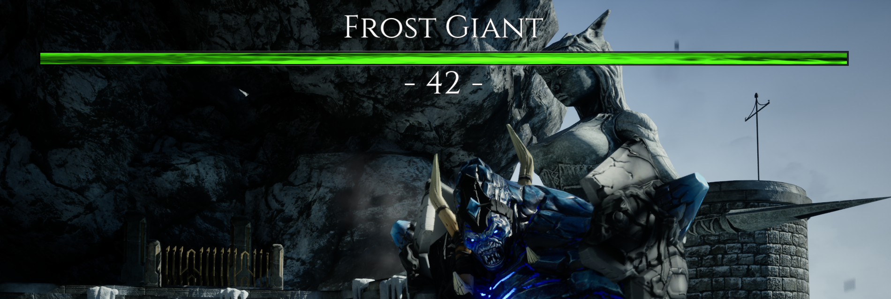
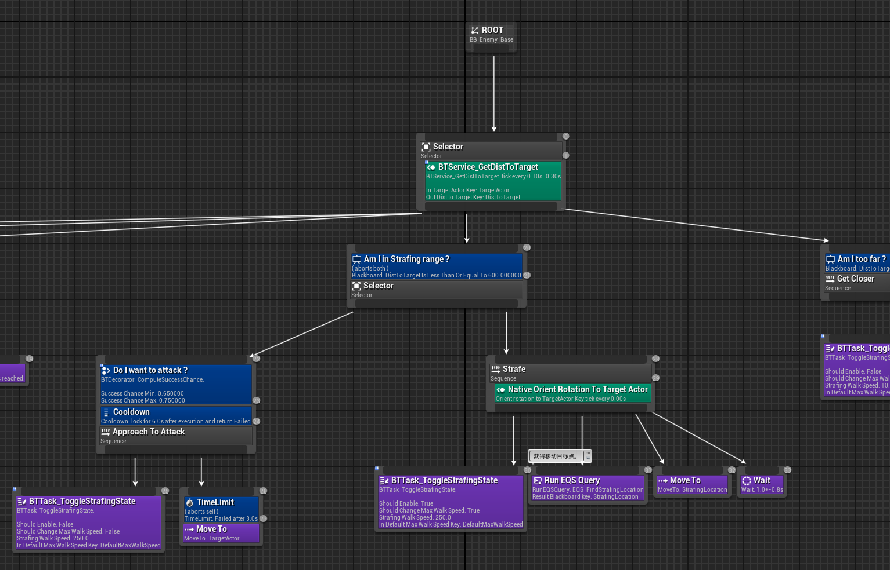
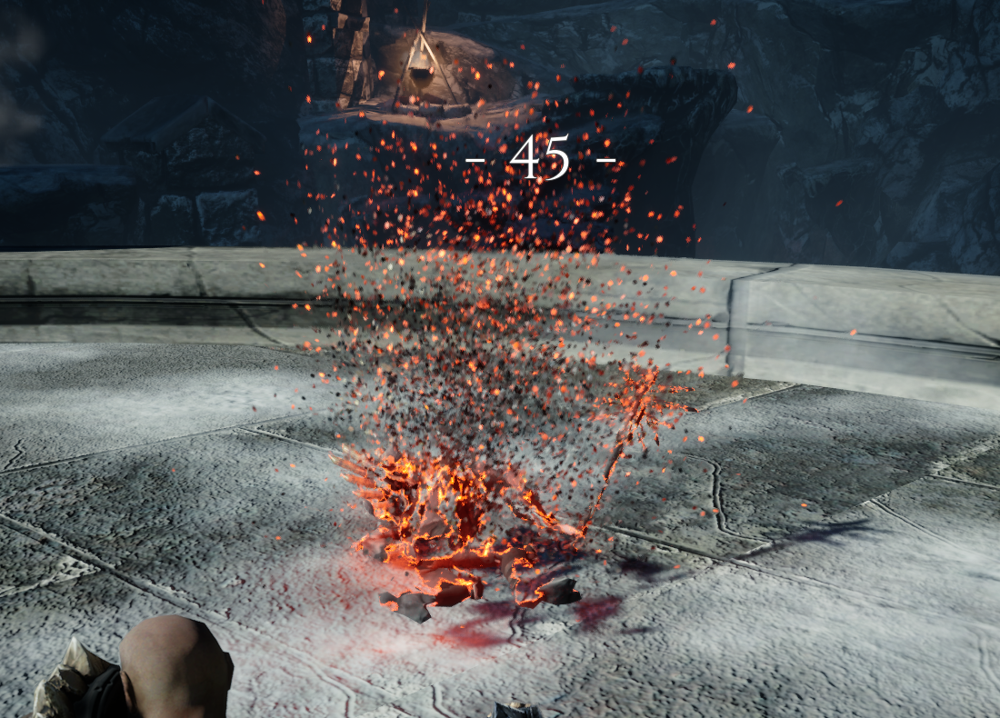

# 【Blur ARPG Warrior】
---

### ***阅读中文文档 >[中文](README_cn.md)***
### ***日本語のドキュメントを読む >[日本語](README_ja.md)***
### ***Read this document in >[English](README_en.md)***

プロジェクトのコメントの翻訳が進行中です。
Translation of project comments is in progress.
---

# 【プロジェクト紹介】
`Unreal Engine 5.4.4`を使用して開発された`ARPG`ゲームです。`Gameplay`フレームワークをベースに開発され、`GAS`プラグインを使用してスキル機能を実現しています。\
コア機能部分はC++を使用し、上層機能はブループリント、標準的な商業開発モードを採用しています。\
サバイバルゲームモードでは、プレイヤーがHeroキャラクターを制御してアリーナ内で様々なモンスターと戦うことができます。

## 【今後の研究方向】
機能コードと上層コードの分離、ARPGGameFrameworkプラグインを基盤機能プラグインとして封入し、再利用性を向上させる。\
プロジェクトリンク：https://github.com/BlurFeng/Blur_ARPG_Samurai

高度なキャラクターステートマシンの運用で、ゲーム表現を向上させる。\
プロジェクトリンク：https://github.com/BlurFeng/BlurAdvancedCharacterLocomotion

# 【開発内容】
C++とブループリントを使用して、ゲームの基盤フレームワークから上層機能まで完全に開発しました。また、表を通じて機能データの設定が可能にしています。\
主なフローのUIおよびUIマテリアルの開発と修正、一部のImageアセット作成。

## 【プロジェクト　フレームワーク】
Unreal EngineのGameplayフレームワークを基にした全体的なプロジェクトフローを開発し、Character、Player Controller、Camera、および各種機能Componentを含みます。\
Data AssetsとCurve Tableを基にしたプロジェクト設定フローを開発。\
Gameplay Tagを基にしたグローバル状態管理。\
USaveGameクラスを基にした簡単なセーブシステム。\
UMGを基にしたUI共通テンプレートクラス作成とゲームUI作成。

## 【キャラクター　アニメーション　ステートマシン】
アニメーションブループリント、Animation Layer、BlendSpaceを基にしたキャラクターアニメーションステートマシンの開発。\
8方向移動のLocomotionアニメーションステート、ArmとUnarm状態間の切り替えは可能。\
Montageベースのイベントアニメーション（Attack）の融合。Notifyを使用して機能ロジックと連携。\
MotionWarpingを使用したスキルにおける位置変化。\
アニメーション効果音および特殊効果の設定。

## 【スキル　システム】
`GAS`および`GameplayTag`を基にしたスキルシステムとゲーム状態管理。\
プレイヤーがキャラクターを制御して攻撃、防御、回避ロールなどの機能を開発。\
敵のスキルの開発。\
アイテムの機能開発。たとえば、体力、スタミナ、怒りゲージを回復する機能など。\
`GameplayCue`を通じてスキルのサウンドや特殊効果の再生を実現。

## 【ゲームモード】
サバイバルモードと4つの選択可能な難易度を提供。\
様々なゲームモード状態間の切り替え、設定可能な待機時間、波数制限時間をサポート。\
敵生成器の設定が可能で、敵の種類、ランダム数、今回敵人の最大数、生成間隔時間などを設定可能。

## 【UIインターフェース】
`UMG`を基にしたUI全体の開発。各種ボタン、プログレスバー、アイコンなどのテンプレートUIコンポーネントを開発し、UIインターフェース開発の効率を向上。UIアニメーションの開発により全体的な画面効果を向上。\
ヒーロー　ステータス　スクリンでは、体力、スタミナ、怒りゲージ、現在の武器装備および武器スキルを表示。ロックオンモードの追跡UIも含む。\
敵のステータス　スクリンでは、雑魚兵士のステータスバーとボスのステータスバーを表示。

\
ボスのステータスバー。

主なフロー画面では、メイン画面、設定画面、一時停止画面、勝利画面、敗北画面の開発。\
サバイバルモードフローUI画面では、モードとフローのヒント、カウントダウンの開発。

## 【ヒーロー】

### 入力システム
`EnhancedInput`を基にした操作システム。武器を装備している間、入力操作を上書きし、同じ入力で異なるキャラクターの反応を得ることが可能。\
キーボードとマウス、そしてゲームパッド操作に対応しています。
### 体力
体力は攻撃を受けると減少。アイテムを使用して体力を回復可能。
### スタミナ
軽攻撃、重攻撃、回避ロール、防御などの行動には一定量のスタミナを消費。スタミナが不足すると、これらの行動は実行できない。\
行動を停止した後にスタミナは自動的に回復。また、アイテムを使用してスタミナを素早く回復可能。
### 怒りゲージと怒り状態
敵にヒットしてダメージを与える、または攻撃を受けることで怒りゲージを増加可能。また、アイテムを使用して怒りを獲得することも可能。

\
怒りゲージが満タンになると、怒り状態を発動可能。怒り状態では、攻撃が追加効果を持つようになる（例：衝撃波を生成して敵を攻撃する）。

\
怒り状態中は怒りゲージが徐々に減少。怒りゲージが空になるまで終了です。または残量が少ない場合はプレイヤーは怒り状態を手動で終了可能。

### 回避ロール
回避ロールスキル。大きく移動して敵の攻撃を回避可能。\
連続で回避ロールを行うこと、または回避ロール後に攻撃を行うことが可能。

### 装備機能
武器の装備および解除。異なる武器によりキャラクターに異なるスキルを付与可能（例：軽攻撃、重攻撃、特殊スキル、防御など）。

### 目標ロックオン
キャラクターが武器を装備している場合、敵をロックオン可能。また、複数の敵間で切り替えも可能。

### 攻撃コンボ
軽攻撃と重攻撃のコンボスキル。1つのコンボスキル内での各ステージ間の接続、および異なるコンボスキル間の切り替え。
また、以下のような詳細な設定をコンボの各攻撃イベントに対応させることができます：\
「次の入力の受付開始」\
「次の攻撃の実行許可」\
「リセット」\
これにより、プレイヤーの入力リズムの速さに応じて、コンボ全体の速度が変化する仕様に対応できます。\
さらに、JumpToAbilityInfos の設定を行うことで、任意の段階で別のスキルコンボに切り替えることが可能です。これを組み合わせることで、複雑なコンボの切り替えを実現できます。

\
軽攻撃1 > 軽攻撃2 > 軽攻撃3 > 重攻撃フィニッシュ

### 武器スペシャルスキル
武器のスペシャル　スキルにより、プレイヤーはクールダウンを持つ強力なスキルを使用して敵を攻撃可能。

### 防御
防御機能。通常防御、パーフェクト防御、防御後反撃。

## 【敵キャラクター】

\
Guardian：近接戦闘の雑魚敵。

\
Glacer：遠距離攻撃を行う雑魚敵。

\
FrostGiant：ボス敵キャラクター。

### AI
\
`Behavior Tree`（ビヘイビアツリー）を基にした敵AI機能。敵が自動的にプレイヤーを攻撃、回避、小兵召喚などの行動を実行可能。\
`Detour Crowd Avoidance` を活用した群衆回避機能。敵が多数いる場合でも、自然な移動が可能。\
`EQS`（環境クエリシステム）を基に、敵が必要とするターゲット（例：攻撃対象、移動目標点）を取得可能。\
`NavMesh`（ナビゲーションメッシュ）を基にした敵の生成ポイントおよび移動経路の検索機能。

### 攻撃スキル
雑魚敵およびボス敵の多彩な近接攻撃スキルと遠距離攻撃スキル。GCを活用してスキルのサウンドやエフェクトを実現。\
一部の防御不能スキルは、攻撃時にエフェクトで警告表示を行う。

\
近接攻撃スキル。

\
遠距離攻撃スキル。

\
ボス敵の攻撃スキル。

### 召喚スキル

\
ボス敵は低体力時に雑魚敵を召喚して支援を行う。

### 危険警告
\
防御不能攻撃の場合、エフェクトで警告を表示。

## 【アイテム】
### エネルギーストーン
ライフストーン、スタミナストーン、怒りストーン。プレイヤーが拾得して使用することで、一定量の体力、スタミナ、または怒りゲージを回復可能。
ストーンは敵の死亡時にドロップ。設定されたランダムな出現確率に基づき、さまざまなストーンを生成可能。

## 【ロジック機能】
ゲーム開発を支援するさまざまな機能的なメソッド。

### 【Debug Helper】
C++で使用するDebugツールクラス。迅速にDebugを行うための補助機能を提供。

### 【カウントダウン】
CountDownメソッド。`Latent Action`を基にしたカウントダウンのブループリントノードを実装。\
ブループリント内でカウントダウンノードを作成可能。StartやCancelをサポートし、Update、Completed、Cancelled時に特定のロジックを実行可能。\
非同期処理のロジックに対応（例：カウントダウンやクールダウンのUI表示）。\
Delayノードは`Latent Action`の典型的な例。

### 【GAS】
#### スキルタスク
##### Tick更新
UAbilityTask_ExecuteTaskOnTick クラスは、Gameplay Ability 内部でのTick機能を実装。\
GA内部でTickによるロジック処理が可能（例：ターゲットロックスキル中、Tickでキャラクターの自動ターゲット方向更新やターゲット切り替え判断を実施）。
##### Event待機およびActor生成
UAbilityTask_WaitSpawnActors クラスは、GameplayTagイベントを待機し、その後Actorを生成。\
GA内で敵召喚ロジックを構築するのに使用可能。
#### GE計算クラス
UGEExecCalc_DamageTaken クラス。設定可能なパラメータに基づき、最終ダメージを計算。
UGEExecCalc_GainRageByDaTa クラスは、設定されたパラメータを基にダメージを受けた際の怒りゲージ獲得量を計算。

### 【重み付きランダム】
Random Index By Weights シリーズのメソッド。プレイヤーが重み配列を渡すことで、ランダムなIndexを返却可能。\
敵の死亡時、設定された重みに基づきランダムにアイテムをドロップする際に使用可能。

### 【Lerpと最小変化量の制限】
Lerp Limit Change Min メソッドは、2つの数値間で補間を行い、最小変化量を制限。\
体力ゲージ増減時のUIアニメーションを自然に変化するために活用可能。

## 【材質とエフェクト】
材質の制作および拡張。敵の被ダメージエフェクトや死亡時のディゾルブエフェクトなどを実装。\

Niagaraエフェクトの使用。\
敵の被ダメージ、登場、死亡時の演出効果に活用。

# 【デバッグガイド】
`'`キー（Enterキーの左隣）で総合コンソールを開く。テンキーの数字キーで表示内容を切り替え可能。\
プレイ中にマウスを非表示にした場合は、Shift + F1でマウス表示をオン。

## 自動障害物回避
`·`キー（Escキーの下）でコンソールを開き、`ai.crowd.DebugSelectActor 1` を入力後、敵のActorを選択して自動障害物回避に関連する情報をデバッグ表示。

## GAS
`·`キー（Escキーの下）でコンソールを開き、`showdebug abilitysystem` を入力してGAS関連のデバッグ画面を表示可能。\
PageUpキーとPageDownキーで対象キャラクターを切り替え可能。\

DefaultGame.iniに以下の設定を追加する必要がある：\
[/Script/GameplayAbilities.AbilitySystemGlobals]\
bUseDebugTargetFromHud = true

## NavMesh
シーンを選択後、`P`キーでNavMesh生成範囲を表示／非表示を切り替え可能。\
BT（ビヘイビアツリー）のMoveTo機能はNavMeshをサポートする必要がある。

## EQS
シーンに EQSTestingPawn を配置し、使用するEQを設定。シーン内でEQSに関連する情報データを可視化可能。

# 【アセット】
キャラクターアニメーションとモデルは、UE公式プロジェクト「Action RPG」を使用。\
 https://www.fab.com/zh-cn/listings/ef04a196-03c1-4204-998a-c7d5264fade7

シーンモデルは、無料リソース「Infinity Blade Ice Lands」を使用。

UINavigationプラグインは、複数のハードウェア入力でUIを操作するためのものです。